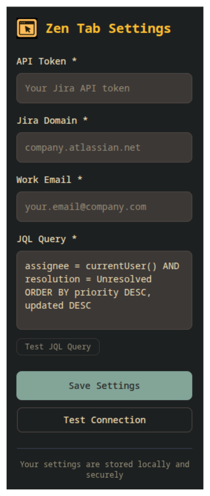

<div align="center">
  
</div>

# 🧘‍♂️ Zen Tab – Your Peaceful Productivity Dashboard

<div align="center">

[](https://github.com/scifisatan/zen-tab/releases)
[](https://github.com/scifisatan/zen-tab/issues)
[](https://github.com/scifisatan/zen-tab/stargazers)
[](https://github.com/scifisatan/zen-tab/blob/main/LICENSE)
[](https://github.com/scifisatan/zen-tab/actions)

</div>


> **Zen Tab** is a Chrome and Firefox extension that turns your new tab into a serene and productive workspace. Instantly view your Jira issues and access work/personal links from a beautifully minimal dashboard.

## ✨ Features

- 🧩 [**Jira Integration**](https://github.com/scifisatan/zen-tab/wiki/Jira-Integration)  
  Automatically display issues assigned to you via the Jira API.

- 🚀 [**Quick Access Shortcuts**](https://github.com/scifisatan/zen-tab/wiki/Using-the-Dashboard)  
  Organize your links into **Work**, **Social**, and **Tools**.

- 🌙 Minimalist Dark UI  
  A distraction-free interface for focused work.

- 🔄 Real-Time Task Updates  
  Click **Refresh** to sync your task list instantly.

- 💻 Built for Developers  
  Zen Tab was made for engineers who want everything in one place.

<details>
<summary>
<h2>
<a href="https://github.com/scifisatan/zen-tab/wiki/Installation">🧭 Installation Guide</a>
</h2>
</summary>

### Chrome

#### CRX File (Recommended)

1. Download `.crx` from [Releases](https://github.com/scifisatan/zen-tab/releases)
2. Open `chrome://extensions/`
3. Enable **Developer mode**
4. Drag & drop the `.crx` file

#### ZIP File (Manual)

1. Download & extract ZIP
2. Load it via **Load Unpacked**

### Firefox

#### XPI File

1. Download `.xpi` from Releases
2. Drag it into Firefox → Click **Add**

#### ZIP File (Temporary Dev Mode)

1. Load via `about:debugging` → **Load Temporary Add-on**

</details>

<details>
<summary>
<h2>⚙️ <a href="https://github.com/scifisatan/zen-tab/wiki/Jira-Integration">Jira Setup</a></h2>
</summary>

<div align="center">
  
</div>

You can configure Jira directly in the extension popup:

1. Open the extension by clicking the Zen Tab icon in your browser
2. Fill in:
   - **API Token**
   - **Jira Domain** (e.g. `yourcompany.atlassian.net`)
   - **Work Email** (your Jira login)
   - **JQL Query** (default provided)
3. Click **Test JQL Query** to preview your tasks
4. Click **Save Settings**

> 🛡️ **Note:** Your settings are stored securely in your browser and never leave your device.

> 🔐 We're currently using [unscoped Jira API keys](https://id.atlassian.com/manage-profile/security/api-tokens) and will soon migrate to **OAuth-based scoped access** for improved security and control.

</details>

<details>
<summary>
<h2>🧪 <a href="https://github.com/scifisatan/zen-tab/wiki/Local-Development">Local Development</a></h2>
</summary>

```bash
git clone https://github.com/scifisatan/zen-tab.git
cd zen-tab
npm install
npm run build
```

Then:

- Open `chrome://extensions/` → Load `dist/`
- Or in Firefox: `about:debugging` → Load `dist/manifest.json`

</details>

<details>
<summary>
<h2>🛠 <a href="https://github.com/scifisatan/zen-tab/wiki/Production-Build-&-CI">Build & CI Setup</a></h2>
</summary>

Zen Tab uses GitHub Actions to:

- Build the extension on version tag push
- Package `.crx` for Chrome
- Sign `.xpi` for Firefox
- Publish changelogs/releases automatically

| Secret Name          | Use Case                       |
| -------------------- | ------------------------------ |
| `FIREFOX_API_KEY`    | Firefox signing API key        |
| `FIREFOX_API_SECRET` | Firefox signing authentication |
| `CHROME_KEY_B64`     | Encoded private key for `.crx` |

</details>

<details>
<summary>
<h2>🙋‍♂️ <a href="https://github.com/scifisatan/zen-tab/wiki/Contributing">Contributing & Feedback</a></h2>
</summary>

We welcome PRs, issues, and suggestions!
Start by opening an [issue](https://github.com/scifisatan/zen-tab/issues) or reading the [contribution guide](https://github.com/scifisatan/zen-tab/wiki/Contributing).

</details>