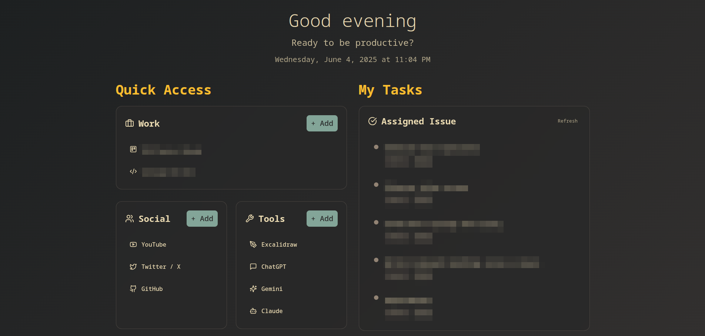

<div align="center">
  
</div>

# 🧘‍♂️ Zen Tab – Your Peaceful Productivity Dashboard



> **Zen Tab** is a custom Chrome and Firefox extension that transforms your new tab into a serene and productive workspace. Instantly view your assigned Jira issues and access your most-used work tools and personal links—all from a beautifully minimal dashboard.

## ✨ Features

- 🧩 **Jira Integration**  
  Automatically fetch and display issues assigned to you via the Jira API.

- 🚀 **Quick Access Shortcuts**  
  Organize your essential links under **Work**, **Social**, and **Tools** categories for easy access.

- 🌙 **Minimalist Dark UI**  
  A clean, distraction-free interface to keep your focus where it matters.

- 🔄 **Real-Time Task Updates**  
  Keep your task list up-to-date with a single click using the "Refresh" button.

- 💻 **Built for Developers**  
  Zen Tab is designed for engineers and professionals who want their tools and tasks in one place.

## 🔧 Chrome Installation Guide

### Option 1: CRX File (Recommended)

1. Download the `.crx` file from the release
2. Open Chrome and go to `chrome://extensions/`
3. Enable "Developer mode" (toggle in top right)
4. Drag and drop the CRX file into the extensions page
5. Click "Add extension" when prompted

### Option 2: ZIP File (Alternative Method)

If Chrome blocks the CRX file or you prefer manual installation:

1. Download the Chrome ZIP file from the release
2. Extract the ZIP file to a folder
3. Open Chrome and go to `chrome://extensions/`
4. Enable "Developer mode" (toggle in top right)
5. Click "Load unpacked"
6. Select the extracted folder containing `manifest.json`

### Option 3: Manual Installation (Advanced)

For development or if other methods fail:

1. Download the source code from the repository
2. Build the extension locally
3. Extract to a folder
4. Open Chrome and go to `chrome://extensions/`
5. Enable "Developer mode" (toggle in top right)
6. Click "Load unpacked"
7. Select the extracted folder containing `manifest.json`

### Troubleshooting

- Chrome may show security warnings for unpacked extensions
- CRX files are signed and preferred for distribution
- ZIP files provide a convenient unpacked version
- Make sure "Developer mode" is enabled for ZIP/manual installation
- Some enterprise Chrome installations may block extension installation

## 🦊 Firefox Installation Guide

### Option 1: XPI File (Recommended - if available)

If an `.xpi` file is available in the release:

1. Download the `.xpi` file
2. Open Firefox
3. Drag and drop the XPI file into Firefox
4. Click "Add" when prompted

### Option 2: ZIP File (Always Available)

#### For Temporary Installation (Recommended for testing):

1. Download the Firefox ZIP file from the release
2. Extract the ZIP file to a folder
3. Open Firefox and go to `about:debugging`
4. Click "This Firefox" on the left
5. Click "Load Temporary Add-on..."
6. Navigate to the extracted folder and select `manifest.json`

**Note:** Temporary installations are removed when Firefox restarts.

#### For Permanent Installation (Developer Edition/Nightly only):

1. Download the Firefox ZIP file from the release
2. Extract the ZIP file
3. Open Firefox Developer Edition or Nightly
4. Go to `about:config` and set `xpinstall.signatures.required` to `false`
5. Go to `about:addons`
6. Click the gear icon → "Install Add-on From File"
7. Select the ZIP file (or rename .zip to .xpi first)

### Troubleshooting

- Regular Firefox won't install unsigned extensions permanently
- Use Firefox Developer Edition or Nightly for unsigned extensions
- ZIP files work as temporary add-ons in all Firefox versions
- If XPI signing failed, only the ZIP option will be available

## 🛠️ Getting Started (Local Dev)

### 1. Clone the Repository

```bash
git clone https://github.com/scifisatan/zen-tab.git
cd zen-tab
```

### 2. Install Dependencies

```bash
npm install
```

### 3. Build the Extension

```bash
npm run build
```

### 4. Load the Extension in Chrome

- Go to `chrome://extensions/`
- Enable **Developer Mode**
- Click **Load unpacked**
- Select the `dist/` folder

### 5. Load in Firefox (Optional)

- Go to `about:debugging`
- Choose **Load Temporary Add-on**
- Select `manifest.json` from the `dist/` folder

## 📦 Production Builds via GitHub Actions

This project uses GitHub Actions to:

- 🔧 **Build the extension on tag push**
- 🗜️ **Package for Chrome (`.crx`)**
- 🔐 **Sign for Firefox (`.xpi`)**
- 🚀 **Auto-generate changelogs and publish a GitHub Release**

### 🔐 Secrets Used in CI

To protect sensitive data, the build pipeline uses these GitHub Secrets:

| Secret Name          | Purpose                               |
| -------------------- | ------------------------------------- |
| `FIREFOX_API_KEY`    | Sign the extension with Mozilla's API |
| `FIREFOX_API_SECRET` | Authentication for Firefox signing    |
| `CHROME_KEY_B64`     | Base64-encoded private key for `.crx` |

> ⚠️ `key.pem` is **never stored in the repo** — it's injected at runtime via GitHub Secrets.

You can view build artifacts on each [GitHub Release](https://github.com/scifisatan/zen-tab/releases) after pushing a tag like `v1.0.0`.

## 🧑‍🎓 Ideal For

- Developers who use Jira regularly
- Productivity nerds who love clean dashboards
- Anyone who wants a better, quieter new tab experience

## 🧠 Contributing & Feedback

Issues and PRs are welcome! If you'd like to contribute or suggest improvements, feel free to open an [Issue](https://github.com/scifisatan/zen-tab/issues).
